# Challenge 2 (I forgot the name)

## Getting Started

### Using Linear Regression and SGD Regression to evaluate

I started applying the data to the regression method.
With only preconfigure data a little bit(selecting data with  correlation coefficient greater than 0.27 and dropping all of the discrete data)
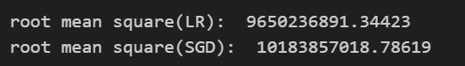

### dealing with discrete data

I looked deep into the column description.
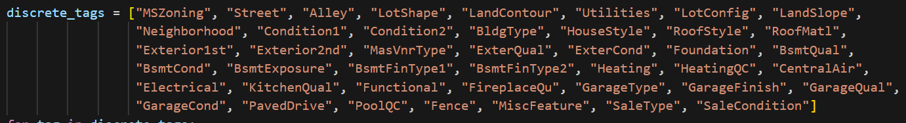
There are too many columns.

So, I use dummy function to create more columns for discrete value.

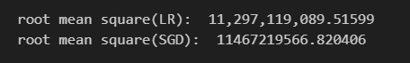
And, the result get worse
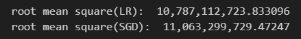

Still got bad results.

=> Remove abs

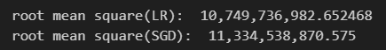

=> split continuous data and discrete data
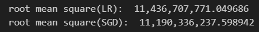
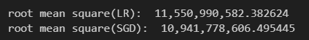
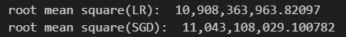
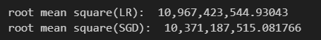

### abs on

continous gte 0.7

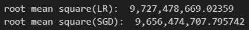
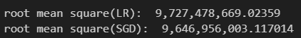
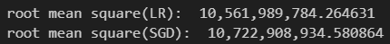
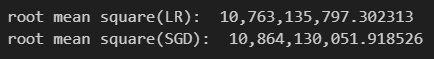

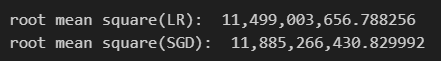

continous gte 0.6

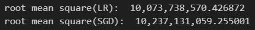
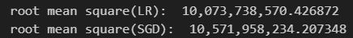
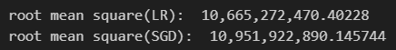
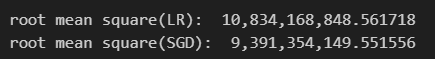
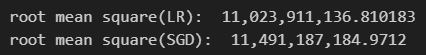
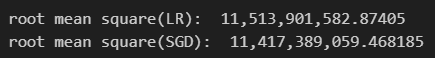

continous gte 0.5

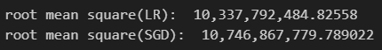
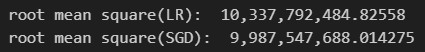
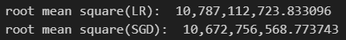
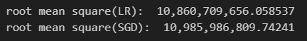
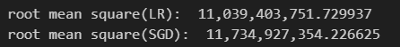

continous gte 0.4

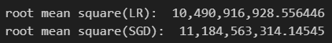
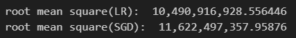
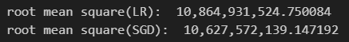
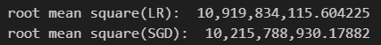
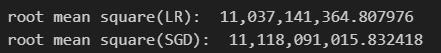

continous gte 0.3

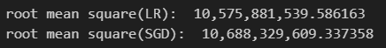
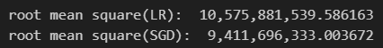
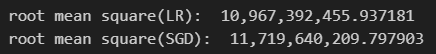
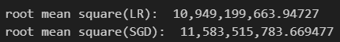