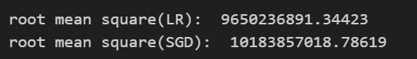

# Challenge 2 (I forgot the name)

## Getting Started

### Using Linear Regression and SGD Regression to evaluate

I started applying the data to the regression method.
With only preconfigure data a little bit(selecting data with  correlation coefficient greater than 0.27 and dropping all of the discrete data)

