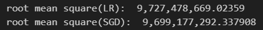
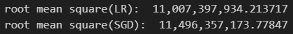

# Challenge 2 (I forgot the name)

## Getting Started

### Using Linear Regression and SGD Regression to evaluate

I started applying the data to the regression method.
With only preconfigure data a little bit(selecting data with  correlation coefficient greater than 0.27 and dropping all of the discrete data)

### dealing with discrete data

I looked deep into the column description.

There are too many columns.

So, I use dummy function to create more columns for discrete value.

And, the result get worse

Still got bad results.

=> Remove abs

=> split continuous data and discrete data

### abs on

continous gte 0.7

continous gte 0.6

continous gte 0.5

continous gte 0.4

continous gte 0.3

